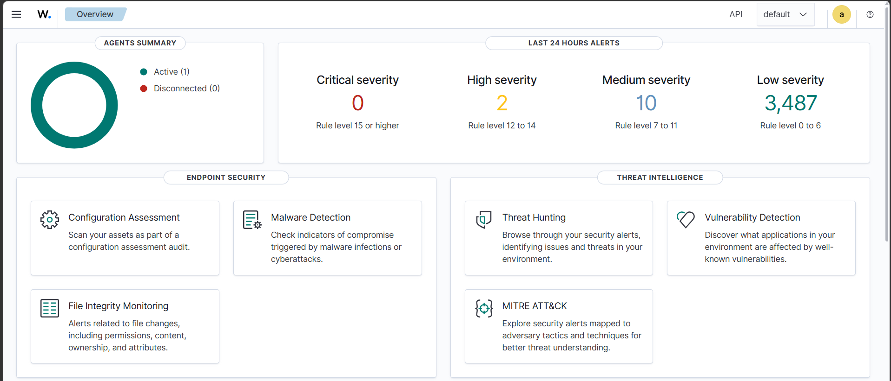
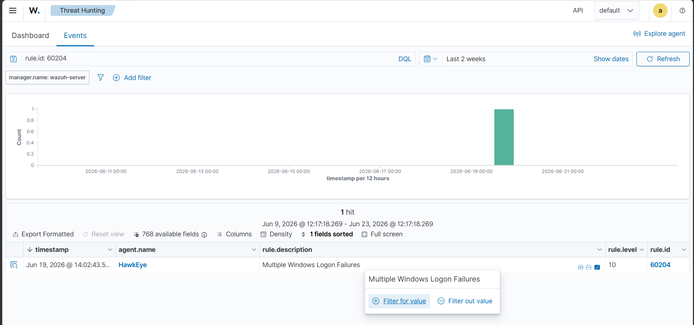
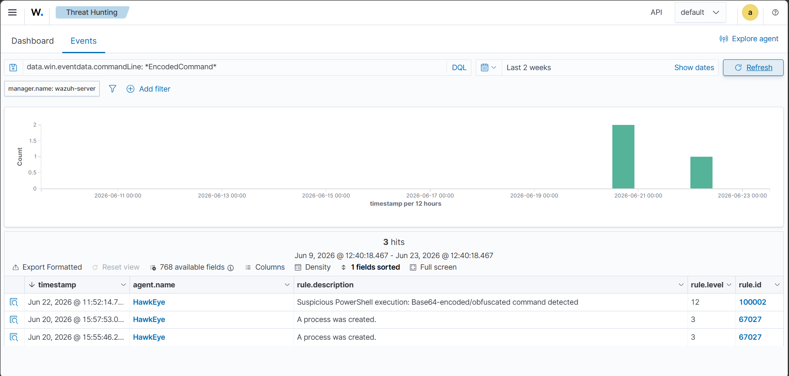
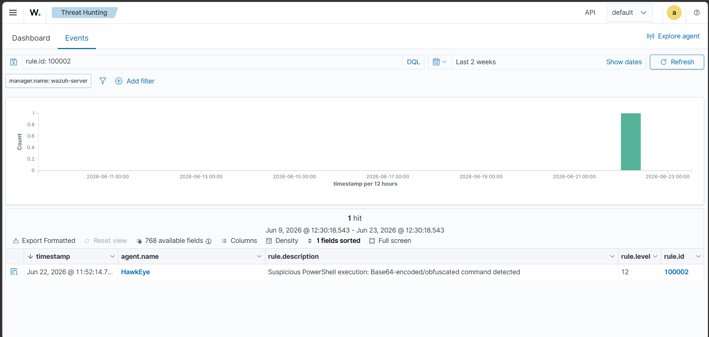
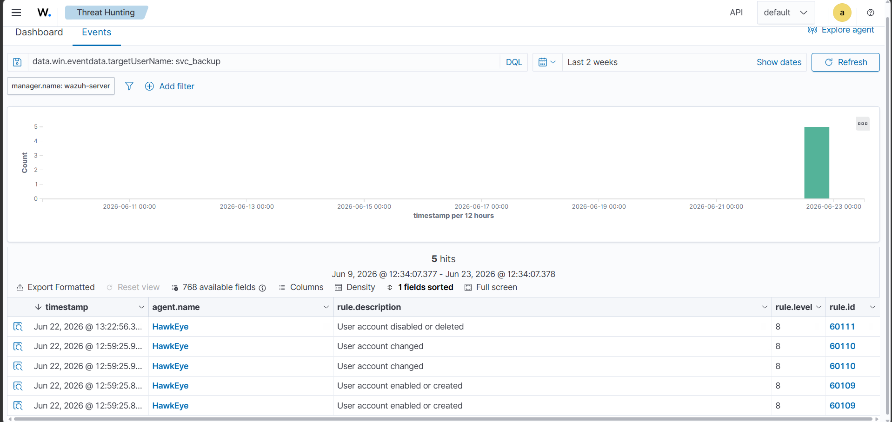

# 🛡️ SentinelX — AI-Assisted SOC Investigation Platform

> A self-hosted Security Operations Center (SOC) lab built for hands-on threat detection, investigation, and incident response — demonstrating real-world analyst skills across attack simulation, SIEM tuning, detection engineering, and formal incident reporting.




---

## 📌 Project Overview

SentinelX is a fully functional SOC lab environment built from scratch using **Wazuh SIEM** deployed via OVA on **VMware Workstation Pro**, with a live **Windows 11 endpoint** enrolled as a monitored agent. Three realistic attack scenarios were simulated, detected, investigated, and documented — covering the full analyst workflow from raw alert to closed incident report.

This project was built as a portfolio piece targeting **SOC Analyst internship roles**, demonstrating practical skills that go beyond certifications and course completions.

---

## 🏗️ Lab Architecture

```
┌─────────────────────────────────────────────────────────┐
│                     Host Machine                         │
│              Windows 11 Laptop (ESHAAN)                  │
│                                                          │
│  ┌──────────────────────┐    ┌────────────────────────┐  │
│  │   VMware Workstation  │    │   Windows Agent        │  │
│  │                      │    │   "HawkEye" (ID: 001)  │  │
│  │  ┌────────────────┐  │    │                        │  │
│  │  │  Wazuh Server  │  │◄───│  • Audit Policy active │  │
│  │  │  (Amazon Linux │  │    │  • Event ID 4688/4624  │  │
│  │  │   2023 OVA)    │  │    │  • Full cmdline logging│  │
│  │  │                │  │    │  • Account Management  │  │
│  │  │ 192.168.136.131│  │    │    auditing enabled    │  │
│  │  └────────────────┘  │    └────────────────────────┘  │
│  └──────────────────────┘                                │
└─────────────────────────────────────────────────────────┘
```

**Stack:**
- **SIEM:** Wazuh 4.x (Manager + Indexer + Dashboard)
- **Endpoint Agent:** Wazuh Windows Agent on Windows 11
- **Virtualisation:** VMware Workstation Pro (NAT networking)
- **OS:** Amazon Linux 2023 (Wazuh server), Windows 11 (endpoint)

---

## 🎯 Scenarios Investigated

### INC-001 — Brute Force Attack
**MITRE:** T1110 (Brute Force) | **Tactic:** Credential Access | **Rule:** 60204 | **Level:** 10


Simulated 10 rapid failed login attempts using a PowerShell `net use` loop against a non-existent account. Wazuh's correlation engine detected the pattern and fired a high-severity alert distinguishing it from isolated failed logins.

**Key skills:** Alert triage, correlation rule analysis, MITRE ATT&CK mapping, incident report authoring

---

### INC-002 — Suspicious PowerShell Execution (Obfuscated)
**MITRE:** T1059.001 + T1027 | **Tactic:** Execution + Defense Evasion | **Custom Rule:** 100002 | **Level:** 12



Simulated a Base64-encoded PowerShell command using `-EncodedCommand -WindowStyle Hidden -NoProfile` flags — a classic living-off-the-land obfuscation technique. **Default Wazuh ruleset failed to flag this at meaningful severity** (buried as generic Level 3 process creation noise).

**Detection gap identified → Custom rule authored and deployed:**

```xml
<rule id="100002" level="12">
  <if_sid>67027</if_sid>
  <field name="win.eventdata.commandLine" type="pcre2">(?i)-(enc|encodedcommand)\b</field>
  <description>Suspicious PowerShell: Base64-encoded/obfuscated command detected</description>
  <mitre>
    <id>T1059.001</id>
    <id>T1027</id>
  </mitre>
</rule>
```

Payload was manually decoded and confirmed as a reconnaissance command (`Get-Process | Out-File`). Custom rule verified firing at Level 12 with full MITRE context in Threat Hunting dashboard.

**Key skills:** Threat hunting, detection gap identification, custom rule engineering, pcre2 regex, payload analysis, detection validation

---

### INC-003 — Unauthorized User Account Creation & Privilege Escalation
**MITRE:** T1136.001 + T1098 + T1078.003 | **Tactic:** Persistence + Privilege Escalation | **Rules:** 60109/60110 | **Level:** 8


Simulated an attacker creating a deceptively-named backdoor local account (`svc_backup`) and immediately adding it to the local Administrators group — a textbook persistence technique. Wazuh's native ruleset detected both events automatically with MITRE T1098 pre-mapped and compliance frameworks (GDPR, HIPAA, PCI-DSS, NIST 800-53) auto-tagged.

**Key skills:** Account-based attack detection, compliance framework awareness, native vs custom coverage assessment

---

## 📊 Detection Coverage Summary

| Incident | Attack Technique | MITRE | Default Coverage | Custom Rule | Severity |
|----------|-----------------|-------|-----------------|-------------|----------|
| INC-001 | Brute Force | T1110 | ✅ Adequate | Not needed | Level 10 |
| INC-002 | Encoded PowerShell | T1059.001, T1027 | ❌ Gap (Level 3) | ✅ Rule 100002 authored | Level 12 |
| INC-003 | Account Creation + Priv Esc | T1136.001, T1098 | ✅ Adequate | Not needed | Level 8 |

---

## 📁 Repository Structure

```
SentinelX-SOC-Lab/
├── README.md
├── incidents/
│   ├── INC-001-Brute-Force-Report.docx
│   ├── INC-002-Suspicious-PowerShell-Report.docx
│   └── INC-003-Account-Creation-Report.docx
├── detection-rules/
│   └── local_rules.xml          # Custom rule 100002
├── screenshots/
│   ├── scenario-1/              # Brute force alert evidence
│   ├── scenario-2/              # PowerShell detection + custom rule
│   └── scenario-3/              # Account creation events
└── lab-setup/
    └── infrastructure-notes.md  # Setup challenges & solutions
```

---

## 🔍 Skills Demonstrated

| Category | Skills |
|----------|--------|
| **SIEM Operations** | Wazuh deployment, agent enrollment, rule management, Threat Hunting queries |
| **Detection Engineering** | Custom rule authoring, pcre2 regex, MITRE ATT&CK mapping, detection gap analysis |
| **Threat Hunting** | Manual investigation, DQL queries, event correlation, noise filtering |
| **Incident Response** | Full IR lifecycle — detect → investigate → contain → report |
| **Windows Security** | Audit policy configuration, Event ID analysis (4688, 4624, 4625, 4720, 4722, 4738) |
| **Attack Simulation** | Brute force, PowerShell obfuscation, persistence via account creation |
| **Documentation** | Professional incident reports with evidence, MITRE mapping, recommendations |
| **Compliance** | GDPR, HIPAA, PCI-DSS, NIST 800-53 framework awareness |

---

## 🛠️ Infrastructure Challenges Solved

Building this lab wasn't plug-and-play. Key problems solved along the way:

- **Wazuh Cloud trial blocked** (college email flagged) → pivoted to self-hosted OVA deployment
- **Ubuntu 26.04 incompatibility** with Wazuh 4.9.2 → rebuilt on Amazon Linux 2023 OVA
- **Systemd timeout errors** on wazuh-indexer and wazuh-manager → applied `TimeoutStartSec=300` overrides via direct shell writes (bypassing nano/VMware keyboard conflicts)
- **VMware Ctrl+O conflict** with nano preventing file saves → developed consistent `echo -e | sudo tee` and heredoc patterns for all config writes
- **SSH clipboard friction** → resolved by routing all admin work through Windows PowerShell SSH session

These friction points are documented because real SOC work involves troubleshooting infrastructure, not just using tools that work perfectly out of the box.

---

## 📋 Incident Reports

Full professional incident reports are available in the `/incidents` folder, each including:
- Executive summary
- Raw alert and event evidence
- MITRE ATT&CK mapping
- Investigation timeline
- Recommendations
- Resolution & closure

| Report | Pages | Highlight |
|--------|-------|-----------|
| INC-001 | 4 | Correlation alert analysis, loopback source identification |
| INC-002 | 6 | Detection gap + custom rule + payload decode — full detection engineering lifecycle |
| INC-003 | 6 | Compliance auto-tagging, two-step attack chain, native vs custom coverage |

---

## 🚀 How to Replicate This Lab

**Requirements:**
- Windows host with VMware Workstation Pro (or Player)
- Minimum 8GB RAM (4GB allocated to VM)
- [Wazuh OVA download](https://documentation.wazuh.com/current/deployment-options/virtual-machine/virtual-machine.html)

**Quick start:**
1. Import the Wazuh OVA into VMware, set networking to NAT
2. Apply `TimeoutStartSec=300` systemd overrides to wazuh-indexer and wazuh-manager (see lab-setup notes)
3. Start services in order: indexer → manager → dashboard
4. Enroll Windows agent via dashboard Deploy Agent wizard
5. Enable Windows audit policy (Process Creation + command line logging, Account Management, Logon/Logoff)
6. Run scenario simulations and investigate in Threat Hunting

---

## 👤 About

Built by **Eshaan** as a hands-on SOC portfolio project targeting cybersecurity applications.

Focused on demonstrating practical skills in threat detection, SIEM operations, and detection engineering — not just theoretical knowledge.

---

*SentinelX is a personal lab project. All attack simulations were performed in an isolated environment on owned hardware.*

